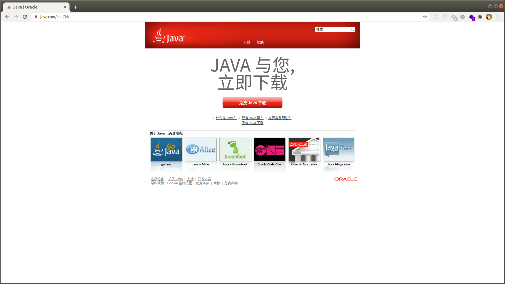

# 运行客户端

## 取得客户端

有多种方式可以取得客户端, 最简单的方式是从群文件下载, 群号详见此帮助文档首页.

或者从 211 代码仓库下载 [https://github.com/211server/211MC-Client](https://github.com/211server/211MC-Client)

又或者也可以自行构建客户端.

## 构建客户端

致命警告: 如果你并非硬核用户请忽略这一步.

//TODO

## 运行客户端

执行客户端中的 HMCL, 若运行出错请详见 HCML 帮助文档 [https://github.com/huanghongxun/HMCL](https://github.com/huanghongxun/HMCL)

成功运行后将看到如下界面

211 Server 使用外置登陆来验证用户, 若从前尚未注册过 211 账户, **请查看下一篇帮助文章来首先完成注册**.

客户端已经配置了验证服务器地址, 不需要再添加认证服务器.

输入 211 用户名和密码后点击确定即可完成登陆.

之后点击右下角的 "启动游戏" 开启游戏.

若计算机性能比较低, 请首先点击左侧游戏版本号旁的齿轮图标来设定配置.

建议内存大小: 4GiB

最低内存大小: 对不起, 没有那么小的内存

游戏启动后点击 "多人游戏", 然后加入到服务器

